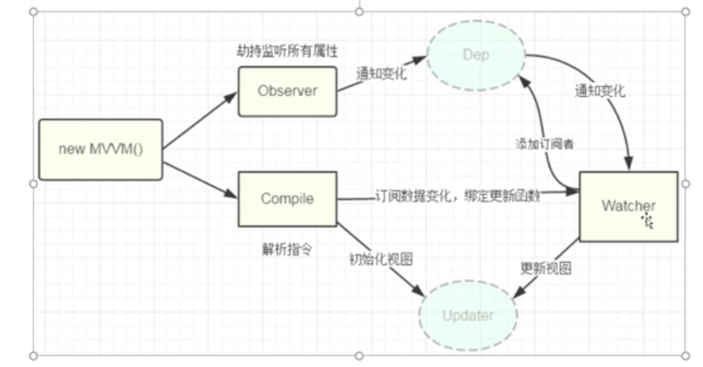

## learn vue：vue原理深入学习
1. 数据响应式/双向绑定原理
    - 订阅者-观察者模式
    
    - 不同版本的区别
        - vue3.0前：Object.defineProperty重定义get和set方法
        - vue3.0：使用ES6中Proxy
    - 内容讲解：https://study.163.com/course/courseLearn.htm?courseId=1209196828#/learn/live?lessonId=1278872042&courseId=1209196828